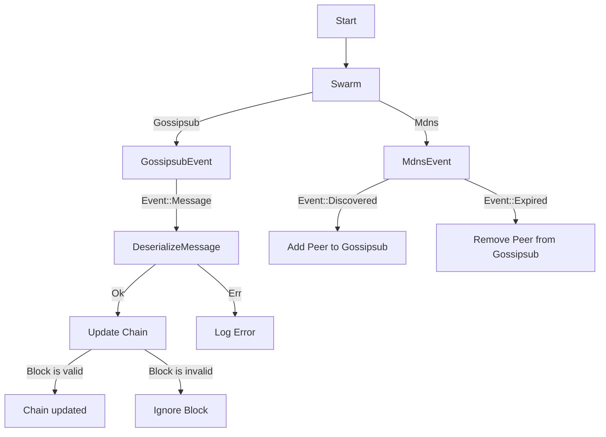

# Temario

1. Rust, WSL, WASM
    - Cryptography 101: Hash Based DS, Digital signatures, encryption
    - Zero Knowledge Proofs
    - Blockchain from scratch
    - Accounts and UTXOs
2. Ink, Solidity, Smart Contracts
3. libp2p

## Cheats
- [Clippy Lints](https://rust-lang.github.io/rust-clippy/master/index.html)
- [cheats.rs](https://cheats.rs/)

## References
1. [🛣️ Roadmap: C++](https://roadmap.sh/blockchain)
2. [🛣️ Roadmap: Software Architect](https://roadmap.sh/software-architect)
3. [🛣️ Roadmap: CyberSec](https://roadmap.sh/cyber-security)
4. [🛣️ Roadmap: Blockchain](https://roadmap.sh/blockchain)
5. [📖 Rust Book](https://doc.rust-lang.org/book/)
6. [📖 Rust Reference](https://doc.rust-lang.org/stable/reference/)
7. [📖 Rust by Example](https://doc.rust-lang.org/stable/rust-by-example/)
8. [📖 The Rustonomicon](https://doc.rust-lang.org/nomicon/)
9. [📖 Comprehensive Rust](https://google.github.io/comprehensive-rust/)
10. [📖 Rust Design Patterns](https://rust-unofficial.github.io/patterns/intro.html)
11. [📖 Learn Rust with Linked Lists](https://rust-unofficial.github.io/too-many-lists/)

## Exercises
- [⚙️ rustlings](https://github.com/rust-lang/rustlings)
- [⚙️ ink-examples](https://github.com/paritytech/ink-examplestree)
- [⚙️ sol2ink](https://github.com/Brushfam/sol2ink)
- [⚙️ ink vs solidity](https://use.ink/ink-vs-solidity)

## Web3/Polkadot Dev Topics
- [WASM](https://developer.mozilla.org/en-US/docs/WebAssembly)
- [WSL/Linux]()
- [Solidity]()
- [Substrate](https://docs.substrate.io/tutorials/)
- [Ink!](https://use.ink/examples/smart-contracts)
- [ZKP]()
- [libp2p]()

## Advanced Rust Topics
- Unsafe, `no_std`
- Async, structured concurrency
- linear/affine types, dependent types, subtyping/variance
- mir, optimization techniques, idiomatic patterns
- hkt, generic associated types

## Ink Topics
- Template, basic macros: `#[ink::contract]`, `#[ink(storage)]`,
	`#[ink(constructor)`, `#[ink(message)]`, `#[ink::test]`,
	`#[ink_e2e::test]`
- Events, RPC Endpoints
- Upgradable contracts
- Environment functions, Chain environment types
- Contract testing, debugging and verification

## Ink Template
```rust
#[ink::contract]
pub mod flipper {
	#[ink(storage)]
	pub struct Flipper(bool);

	impl Flipper {
		#[ink(constructor)]
		pub fn new() -> Self {}

		#[ink(message)]
		pub fn flip(&mut self) {}

		#[ink(message)]
		pub fn get(&self) -> bool {}
	}

	#[cfg(test)]
	mod tests {
		use super::*;

		#[ink::test] 
		fn new_works() {}
	}
}


#[cfg(all(test, feature = "e2e-tests"))]
mod e2e_tests {
	use super::*;
    use ink_e2e::build_message;
    type E2EResult<T> = Result<T, Box<dyn Error>>;

	#[ink_e2e::test] 
	async fn it_works(
		mut client: ink_e2e::Client<C, E>) -> E2EResult<()> {}
}
```

