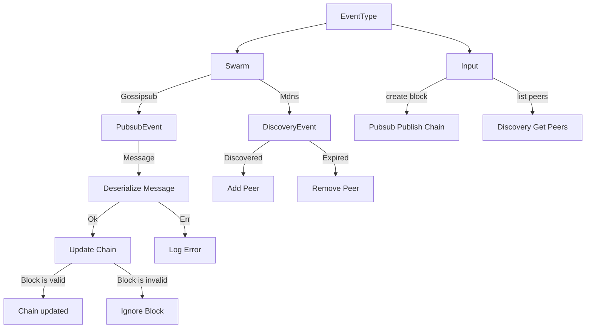
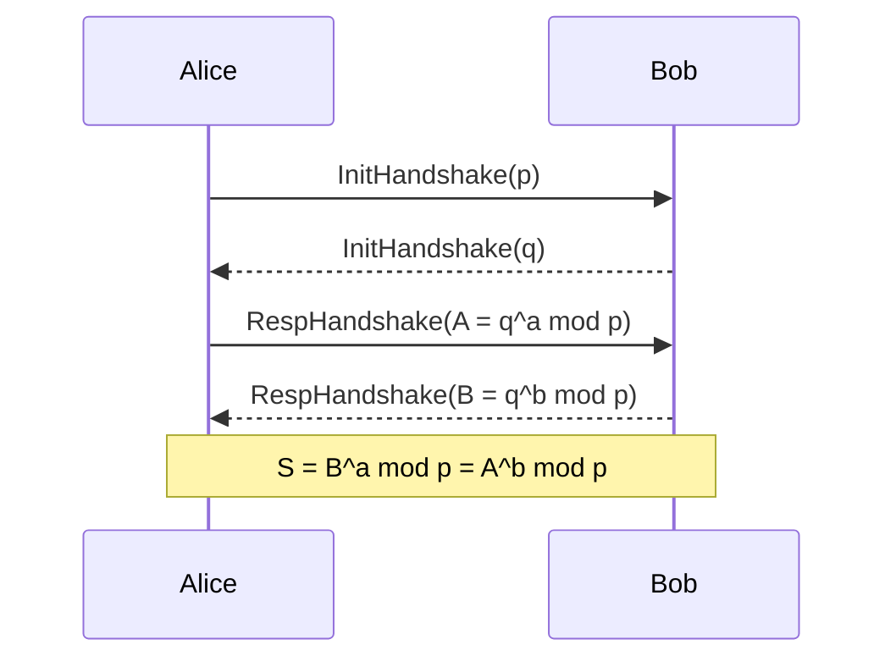
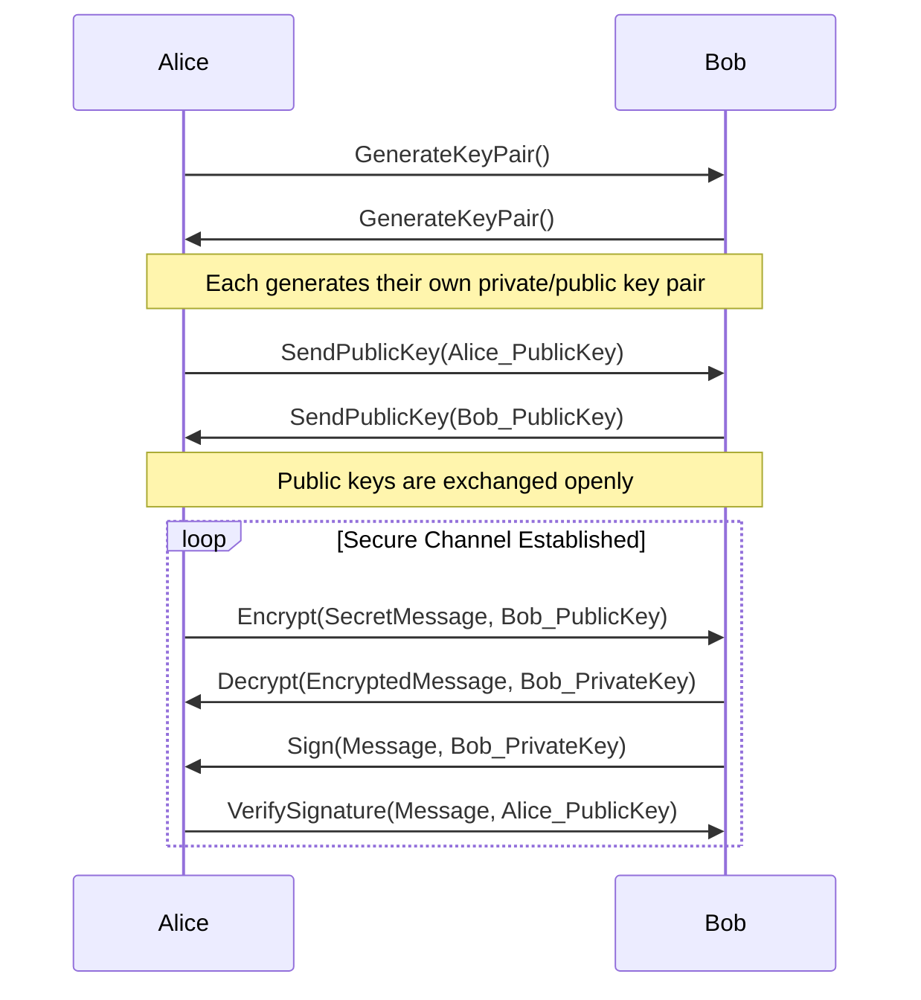

# Minimal libp2p blockchain

- $p$ is *prime*
- $q$ is a *primitive root modulo* $p$
- $a$ and $b$ are random secret numbers, $a, b < p$

A *primitive root modulo* $p$ is an integer $g$ that has a special property when used as the base of exponentiation modulo `p`. Let's break down the properties of primitive roots modulo `p`:

1. **Co-prime with `p`**: A primitive root $g$ must be co-prime with $p$: $$\gcd(g, p) = 1$$This property ensures that $g$ has no common factors with $p$.

2. **Distinct powers**: When $g$ is raised to different powers modulo $p$, the resulting values are distinct residues modulo $p$: $$\forall x \in [1, p) \:\exists!\;g^{x}\;\mathrm{mod}\;p$$This property guarantees that $g$ generates a full set of residues modulo $p$ without repetition.

3. **Generator of the group**: The set of residues modulo $p$ generated by $g$ forms a cyclic group called the multiplicative group modulo $p$, denoted as $Z_p^*$. This group contains all the residues co-prime with $p$. The order of this group is $\phi(p)$, where $\phi$ represents Euler's *totient* function. A primitive root $g$ generates $Z_p^*$ as it spans all possible residues modulo $p$. $\phi(p) = |Z_p^*|$

